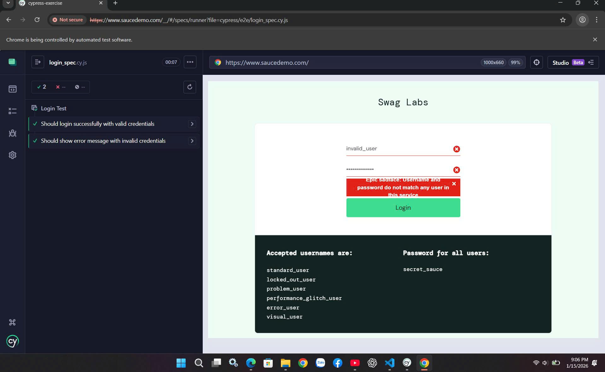
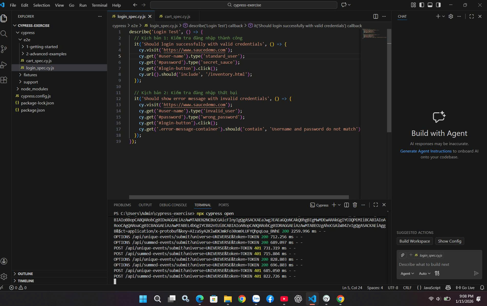
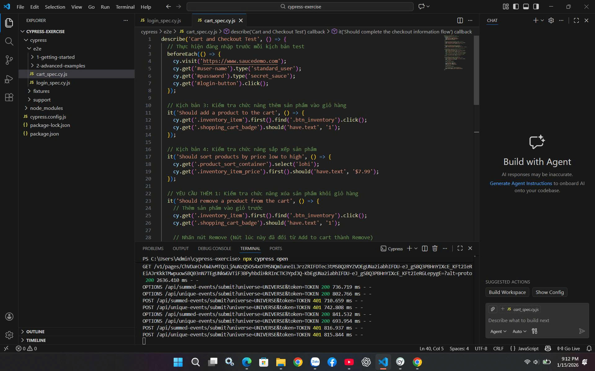
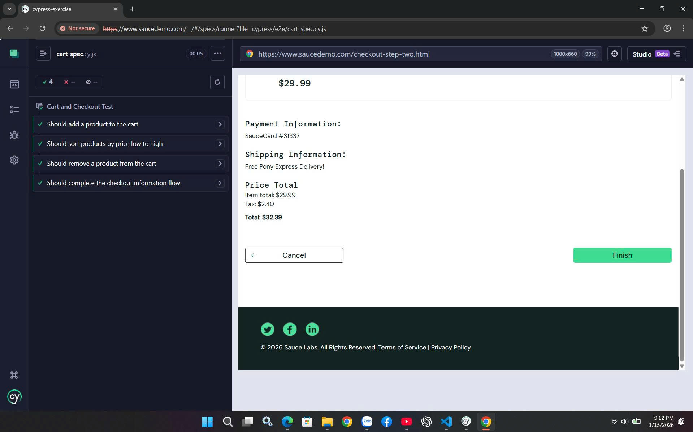

## KIỂM THỬ PHẦN MỀM
## Báo Cáo Kết Quả Chương 1
---
## 1. Kết quả thực hành trên "Can't Unsee"
Trong bài tập này, em đã thực hiện kiểm thử khả năng quan sát và nhận diện lỗi giao diện (UI) thông qua thử thách đào tạo thị giác.

* **Thứ hạng:** <span style="color: #e5e4e2; font-weight: bold;">PLATINUM</span> (Top 5% người chơi)
* **Tổng điểm:** 7,990
* **Thời gian hoàn thành:** 06:02

### Minh chứng kết quả:


---

## 2. Phân tích & Bài học rút ra
Việc đạt mức điểm Platinum cho thấy em đã rèn luyện được các kỹ năng kiểm thử giao diện quan trọng:

1.  **Kiểm thử Pixel-Perfect:** Phát hiện sự sai lệch về khoảng cách (margin/padding) dù chỉ 1-2 pixel.
2.  **Kiểm thử Typography:** Nhận diện sự không đồng nhất về font chữ, độ đậm (weight) và khoảng cách dòng.
3.  **Kiểm thử tính nhất quán (Consistency):** Đảm bảo các thành phần giao diện tuân thủ quy tắc thiết kế chung (Design System).


## Bài tập thực hành kiểm thử với JUnit
## Chủ đề: Phân tích dữ liệu điểm số học sinh

---

## 1. Mô tả bài toán
Bài tập yêu cầu xây dựng một chương trình Java để phân tích dữ liệu điểm số của học sinh, đồng thời viết các ca kiểm thử đơn vị (unit test) bằng JUnit nhằm đảm bảo tính đúng đắn của chương trình.

Chương trình gồm lớp `StudentAnalyzer` với hai chức năng chính:
* **Đếm số lượng học sinh đạt loại Giỏi**: Dựa trên các tiêu chí điểm số hợp lệ.
* **Tính điểm trung bình**: Chỉ tính trên các giá trị điểm nằm trong khoảng cho phép (0 - 10).

---

## 2. Các chức năng chính

### 2.1. `countExcellentStudents(List<Double> scores)`
* **Mô tả**: Đếm số học sinh có điểm **>= 8.0**.
* **Xử lý logic**: Bỏ qua các điểm không hợp lệ (< 0 hoặc > 10), bỏ qua giá trị `null`. Trả về **0** nếu danh sách rỗng.

### 2.2. `calculateValidAverage(List<Double> scores)`
* **Mô tả**: Tính điểm trung bình của các điểm hợp lệ (0–10).
* **Xử lý logic**: Loại bỏ điểm không hợp lệ và `null`. Trả về **0** nếu không có điểm hợp lệ nào.

---

## 3. Cấu trúc thư mục dự án
```text
unit-test/
├── src/
│   └── StudentAnalyzer.java
├── test/
│   └── StudentAnalyzerTest.java
└── README.md

```

* `src/`: Chứa mã nguồn thực thi chính của chương trình.
* `test/`: Chứa các kịch bản kiểm thử đơn vị bằng JUnit 5.

---

## 4. Công cụ và công nghệ sử dụng

* **Ngôn ngữ**: Java JDK 8 trở lên.
* **Thư viện**: JUnit 5.
* **IDE**: Eclipse.
* **Quản lý mã nguồn**: Git & GitHub.

---

## 5. Hướng dẫn chạy kiểm thử đơn vị (JUnit)

### Thao tác trên Eclipse:

1. Mở file `StudentAnalyzerTest.java` trong thư mục `test/`.
2. Chuột phải vào file hoặc vùng soạn thảo code.
3. Chọn **Run As** → **JUnit Test**.

### Kết quả kiểm thử thực tế:


### Phân tích kết quả thực hiện:

* **Thanh màu xanh (Green Bar)**: Toàn bộ **6/6** ca kiểm thử đã vượt qua thành công.
* **Trạng thái**: Không có lỗi (**0 Errors**) và không có sai biệt (**0 Failures**).
* **Các kịch bản đã bao phủ**:
* `NormalCase`: Danh sách điểm hỗn hợp.
* `AllValid`: Danh sách toàn điểm hợp lệ.
* `EmptyList`: Danh sách rỗng.
* `BoundaryValues`: Các giá trị biên và giá trị không hợp lệ.


---

## 6. Kết luận

Thông qua bài tập này, em đã nắm vững:

* **Thiết kế Test Suite**: Biết cách xây dựng các bộ kiểm thử bao phủ các trường hợp biên và dữ liệu bất thường.
* **Sử dụng JUnit 5**: Thành thạo việc sử dụng các Assertions để xác minh tính đúng đắn của logic.
* **Tổ chức dự án**: Hiểu quy trình tổ chức dự án Java theo cấu trúc `src/test` tiêu chuẩn.
* **Kỹ năng công nghệ**: Biết cách sử dụng Git để quản lý phiên bản mã nguồn và ứng dụng AI hỗ trợ trong quá trình lập trình.

---

# Bài tập thực hành kiểm thử tự động End-to-End với Cypress

## Giới thiệu

Dự án thực hiện kịch bản kiểm thử tự động End-to-End (E2E) cho trang web bán hàng mẫu [SauceDemo](https://www.saucedemo.com). Mục tiêu là đảm bảo tính ổn định của các luồng nghiệp vụ quan trọng như Đăng nhập, Giỏ hàng và Thanh toán.

## 📂 Cấu trúc dự án

Dự án được tổ chức theo tiêu chuẩn của Cypress:

* **`cypress/e2e/`**: Chứa toàn bộ các file kịch bản kiểm thử.
* `login_spec.cy.js`: Kiểm tra chức năng xác thực người dùng.
* `cart_spec.cy.js`: Kiểm tra giỏ hàng, bộ lọc và thanh toán.


* **`.gitignore`**: Đã cấu hình để loại bỏ `node_modules`, giúp Repo gọn nhẹ.
* **`package.json`**: Quản lý phiên bản các thư viện và tập lệnh thực thi.

## 🚀 Kịch bản kiểm thử & Kết quả

Tất cả các kịch bản đều đạt trạng thái **Passed** 100%.

### 1. Kiểm thử Đăng nhập (`login_spec.cy.js`)

| ID | Kịch bản | Mô tả | Trạng thái |
| --- | --- | --- | --- |
| TC01 | Đăng nhập thành công | Sử dụng `standard_user` và `secret_sauce` | ✅ Passed |
| TC02 | Đăng nhập thất bại | Kiểm tra thông báo lỗi khi sai thông tin | ✅ Passed |

> **Bằng chứng:**[
### 1. Kiểm thử Đăng nhập (`login_spec.cy.js`)

**Bằng chứng:**



---



### 2. Kiểm thử Giỏ hàng & Thanh toán (`cart_spec.cy.js`)

| ID | Kịch bản | Mô tả | Trạng thái |
| --- | --- | --- | --- |
| TC03 | Thêm vào giỏ | Thêm sản phẩm đầu tiên và kiểm tra badge | ✅ Passed |
| TC04 | Sắp xếp giá | Lọc sản phẩm theo "Price (low to high)" | ✅ Passed |
| TC05 | Xóa sản phẩm | Sử dụng chức năng "Remove" trong giỏ hàng | ✅ Passed |
| TC06 | Thanh toán | Điền thông tin và chuyển hướng đến xác nhận | ✅ Passed |

> **Bằng chứng:**
### 1. Kiểm thử Đăng nhập (`login_spec.cy.js`)

**Bằng chứng:**



---



---


## 🛠 Hướng dẫn cài đặt và sử dụng

1. **Clone dự án:**
```bash
git clone https://github.com/NguyenTrongDoan100205/KiemThuPM.git

```


2. **Cài đặt thư viện:**
```bash
npm install

```


3. **Mở giao diện Cypress:**
```bash
npx cypress open

```


*Chọn file `.cy.js` trong danh sách để xem quá trình chạy tự động.*

---

```
